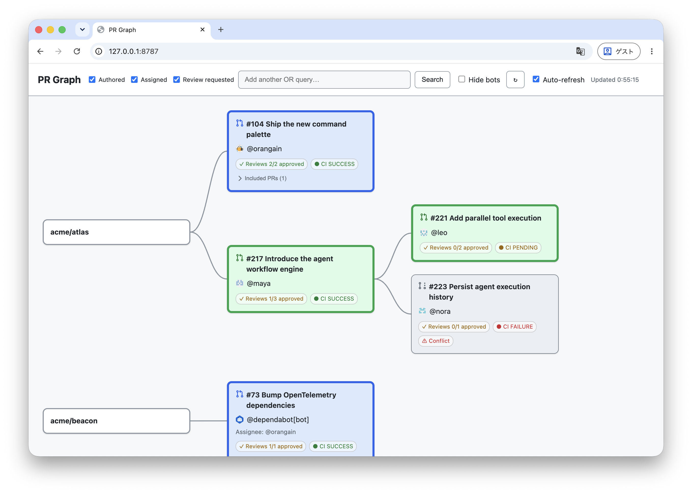

<h1>
  
  gh pr-graph
</h1>

[](https://github.com/orangain/gh-pr-graph/releases/latest)

`gh pr-graph` turns the pull requests that need your attention into one visual workspace. Run one command to see every open PR you authored, were assigned to, or were asked to review—across repositories—without assembling filters or checking separate GitHub pages.



As AI makes it easier to develop multiple changes in parallel, stacked pull requests are becoming larger and more common. A flat PR list hides which change depends on which. `gh pr-graph` follows base and head branches recursively and draws those relationships as a directed graph, making the review order, downstream work, and the path back to each repository immediately visible.

Color-coded ownership and compact review, CI, conflict, and draft signals help you decide what needs action next. A re-review cue highlights fixes waiting on your next pass, so completed changes do not sit blocked on a quick follow-up. Merged PRs included in a change remain available in collapsible context, while automatic refresh keeps the workspace current. Everything runs locally through your authenticated `gh` CLI; GitHub credentials are never passed to the browser.

## Requirements

- [GitHub CLI (`gh`)](https://cli.github.com/), authenticated with `gh auth login`

## Install

```sh
gh extension install orangain/gh-pr-graph
```

Upgrade later with:

```sh
gh extension upgrade pr-graph
```

## Usage

Start the local server and open the PR graph in your browser:

```sh
gh pr-graph
```

The server only listens on `127.0.0.1`. Press Ctrl-C in the terminal to stop it.

Options:

```text
--no-open          print the URL without opening a browser
--port 8080        override the preferred local port (8787)
--hostname HOST    use a GitHub Enterprise hostname
```

### Using the graph

The Authored, Assigned, and Review requested filters are OR conditions. The
search field adds a fourth OR condition using GitHub PR search syntax; clear
all three filters to use only that query. `Show bots` is a local display filter
and does not run the search again.

The graph flows from a base on the left toward PRs stacked on it. A repository
node represents its default branch. When a stack cannot be traced back to that
branch, it starts at a branch node connected to the repository by a dashed
edge.

PR node backgrounds show why a PR is in your workspace:

| PR node color | Meaning |
| --- | --- |
| Blue | Authored by you |
| Cyan | Assigned to you |
| Green | Your review is requested |
| Gray | Related context discovered while following the stack |

When a PR matches more than one category, authored takes precedence over
assigned, which takes precedence over review requested. A thick border means
the PR is ready for review; a thin border and the draft pull-request icon mean
it is still a draft.

`Reviews n/N approved` counts approvals against requested reviewers. The
discussion marker means you have an unsubmitted review; it takes precedence
over the orange sync marker for a PR updated and sent back after your previous
review.

`Included PRs` are merged PRs detected in the containing PR's commit history,
not separate graph nodes.

## Development

Development requires Go 1.23 or newer.
See [DESIGN.md](DESIGN.md) for the architecture and design decisions.

### Build from source

```sh
make test
make build
./gh-pr-graph
```

For local extension development:

```sh
make build
gh extension install .
gh pr-graph
```

### Demo mode

Use the built-in mock pull requests to work on the UI or capture screenshots
without querying GitHub for pull request data:

```sh
GH_PR_GRAPH_DEMO=1 ./gh-pr-graph
```

Demo mode is intentionally enabled only through the `GH_PR_GRAPH_DEMO`
environment variable and does not appear as a command-line option.

### Inspect traces locally

Set `GH_PR_GRAPH_TRACE_OTEL=1` to export traces to
`http://localhost:4318/v1/traces`. Set the variable to an explicit collector
URL to use a different endpoint; the `/v1/traces` path is added when the URL
has no path, for example `GH_PR_GRAPH_TRACE_OTEL=http://localhost:4318`.
The graph and Included PR API requests are root spans with
child spans for PR search, stacked PR discovery, commit inspection, and every
`gh api graphql` command. Command spans include the executed arguments, exit
code, duration, and error status. Trace delivery is asynchronous, batched, and
best-effort, so an unavailable collector does not interrupt the application.

Start the included Jaeger collector and UI:

```sh
docker compose up -d
```

Run the extension with tracing enabled, then load or refresh the PR graph:

```sh
GH_PR_GRAPH_TRACE_OTEL=1 gh pr-graph
```

Open [http://localhost:16686](http://localhost:16686), select the
`gh-pr-graph` service, and click **Find Traces**. `GET /api/v1/graph` covers PR
search and stacked PR discovery, `POST /api/v1/inspect` covers commit inspection
for one containing PR, and `POST /api/v1/included` covers its candidate detail query.

Stop the local collector when finished:

```sh
docker compose down
```

## Releasing

CI runs tests, vet, JavaScript syntax checking, release-note extraction tests, and a build on pushes to `main` and pull requests. User-facing changes are recorded under `Unreleased` in [CHANGELOG.md](CHANGELOG.md).

To publish a version, create a `release/vX.Y.Z` branch and pull request that moves the `Unreleased` entries into a dated version section and updates the comparison links at the bottom of the changelog. Have a human review and merge that pull request into `main`. The merge automatically creates the matching annotated tag and publishes the GitHub Release; do not create the release tag before the pull request is merged.

The release workflow only accepts merged internal release pull requests; pushing a version tag manually does not publish a release. It verifies and extracts the matching changelog section, creates the annotated tag on the merge commit, cross-compiles supported binaries, creates the GitHub Release, publishes the extracted notes, uploads correctly named assets, and generates build provenance attestations. A malformed release branch name or missing or empty version section fails the release. The workflow needs the repository's default `GITHUB_TOKEN` with the permissions declared in the workflow; no additional secret is required.

For discoverability, set the repository topic `gh-extension` after publishing it.

## License

MIT. See [LICENSE](LICENSE).
